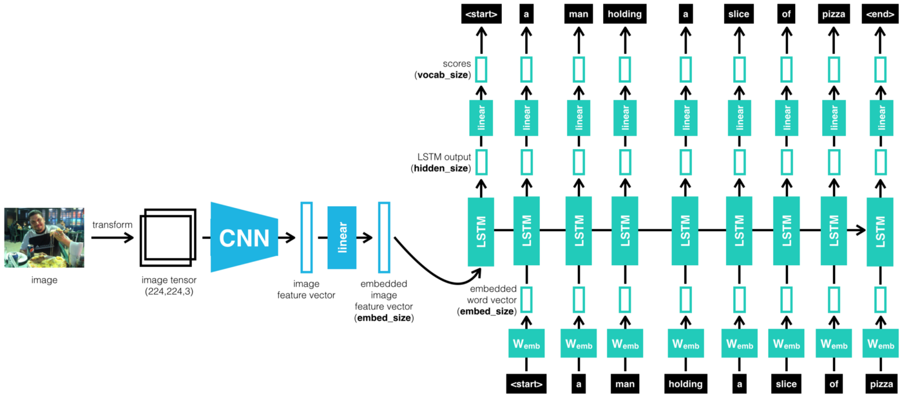
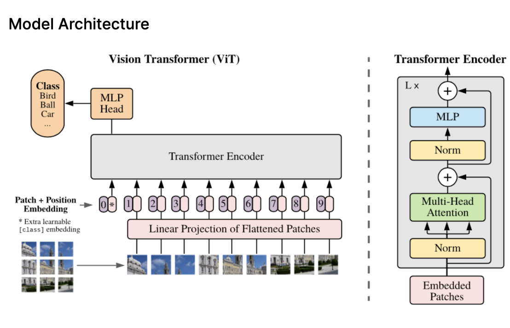
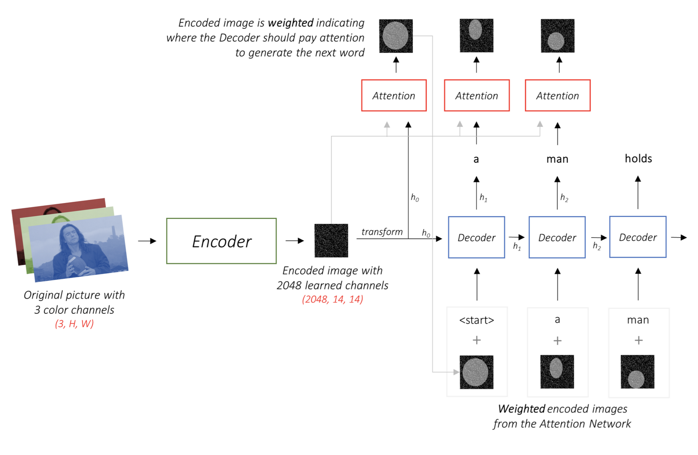

# Analysis of Multi-Modal Feature Representations by CLIP for Image Captioning

## Abstract
Image captioning requires both visual understanding and linguistic processing to learn relationships between images and text. Though it is a difficult task, transformer-based models have made significant improvements as they are capable of representing multi-modal spaces (images and text) into a combined semantic space. In this project, we analyze the performance on image captioning of the transformer-based CLIP pre-training method by using it on the VizWiz-Captions dataset. We establish baseline metrics by implementing a Convolutional Neural Network - Recurrent Neural Network architecture on the same dataset. Our main contribution is to use CLIP's image encoder to successfully improve the performance of the baseline model on image captioning, a task on which CLIP's performance has not been studied extensively. 

## Models
**Baseline CNN-LSTM, Based on the NIC Model:**
The CNN learns a vector representation of the image which is passed into the first unit of a 2-layered LSTM. The LSTM also takes the ground truth caption as input and generates the hidden states and output caption.

**CLIP Image-Encoder Architecture:**
The ViT model splits an image into fixed-size patches, linearly embed each of them, add position embeddings, and feed the resulting sequence of
vectors to a standard transformer encoder.

**Attention-based Decoder Model Review:**

## Data

All images and their captions were obtained from the [VizWiz](https://vizwiz.org/tasks-and-datasets/image-captioning/) dataset.

## Training

The baseline CNN+RNN model is trained using `train_captioning.py`. The `clip_rnn_image_captioning.ipynb` notebook has modified this code for training the modified CLIP+RNN and CLIP+Attention models.

## Validation

For validation along with the loss function BLEU, CIDEr and other metrics were evaluated on the saved generated captions.
`vizwiz_caption_evaluation.ipynb` uses the evalutation code in `vizwiz_eval_cap` to calculate these. This code was obtained from [here](https://github.com/Yinan-Zhao/vizwiz-caption).

The generated captions and resulting scores are stored in the `validation results/` directory.

## Testing

Testing on all models was preformed using `testing.py` to generate image-caption pairs and TSNE plots of the learned image and word latent spaces. These results are saved in the `test results/` directory.

## Results
** BLEU-1,2,3,4/METEOR metrics compared with other models:**

**Captioned Test Images:**

**CLIP+LSTM TSNE plot of image and caption embeddings:**

## Team Members: ##
- Saad Saleem (University of Toronto, saad@cs.toronto.edu)
- Shamitra Rohan (University of Toronto, shamitra@cs.toronto.edu)
- Malikeh Ehghaghi (University of Toronto, malikeh.ehghaghi@mail.utoronto.ca)

